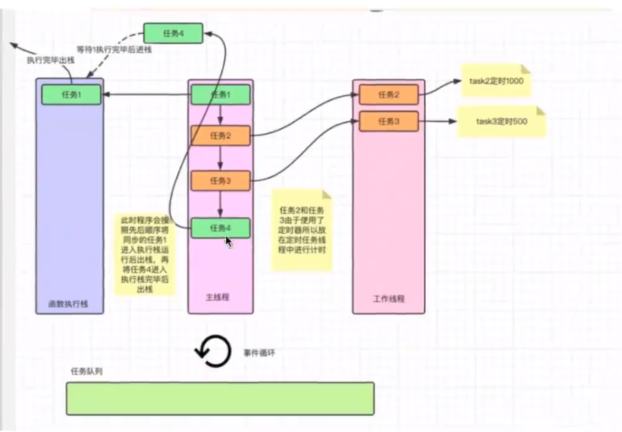
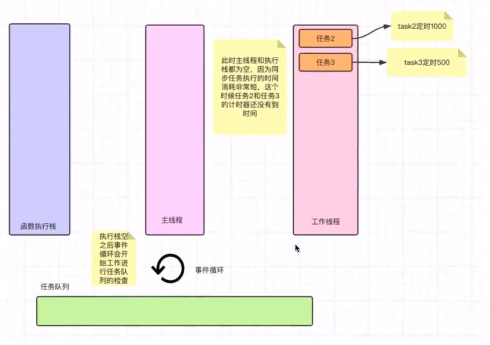
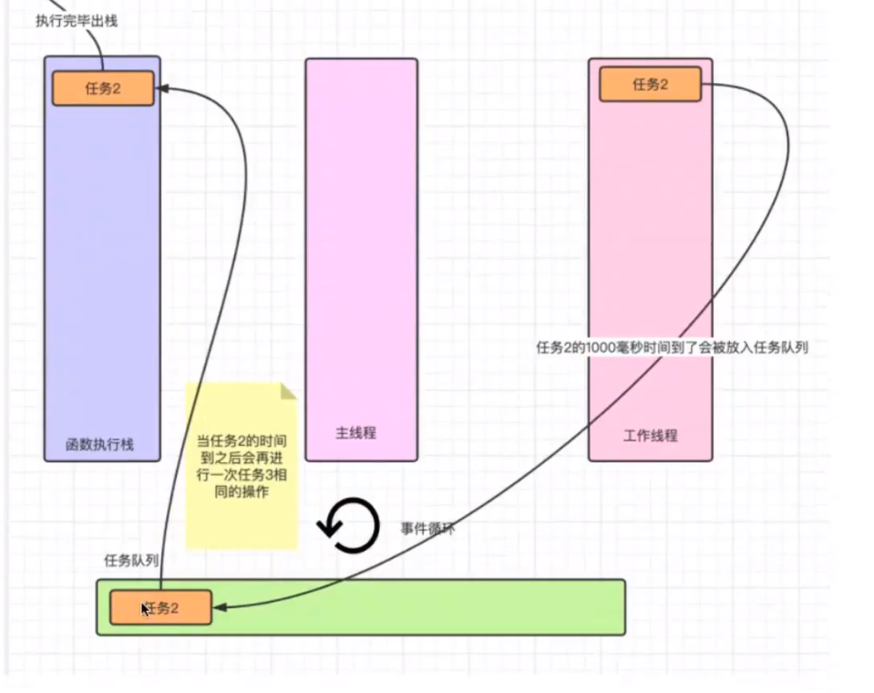

## 浏览器环境的Event Loop

事件循环就是一个循环，是各个异步线程用来通讯和协同执行的机制。各个线程为了交换消息，还有一个公用的数据区，这就是事件队列。各个异步线程执行完后，通过事件触发线程将回调事件放到事件队列，主线程每次干完手上的活儿就来看看这个队列有没有新活儿，有的话就取出来执行。流程图如下：

 

+ 1. 主线程每次执行时，先看执行的是同步任务还是异步API ;
+ 2. 遇到同步任务就继续执行，一直到执行完；
+ 3. 遇到异步API，就把它交给对应的异步线程，自己就行执行同步任务；
+ 4. 异步线程执行异步API ,执行完后，就将回调事件放入事件队列；
+ 5. 主线程上的同比任务执行完后，就读取事件队列中的回调函数并执行；
+ 6. 以上流程不断反复进行，这就是所谓的事件循环机制；

## 为什么定时器不准？

事实上，js中的定时任务并不一定是准时执行，定时事实上是指最早时间；

导致这个现象发生的原因，是因为js 线程总是先执行同步任务，然后再执行事件队列中的回调函数；遇到定时器，现将它交给定时器线程，开始计时，比如2秒，2秒后触发回调事件，事件触发线程就将这个回调事件放入事件队列，异步流程到此结束。主线程如果有空，就将定时器回调拿出来执行，否则计时器回调函数就一直放在队列里。

## 事件队列详解

上面理解event loop 的过程中，为了方便理解事件循环，我们简化了事件队列； 事实上，事件队列中的事件分两类： 宏任务和微任务。

微任务拥有更高的优先级，当事件循环遍历队列时，先检查微任务队列，如果里面有任务，就全部拿来执行，执行完之后再执行一个宏任务。执行每个宏任务之前都要检查下微任务队列是否有任务，如果有，优先执行微任务队列。所以完整的流程图如下：


想要知道一个异步API 在哪个阶段执行， 就要弄清楚它是宏任务还是微任务；

常见微任务：

+ 1. Promise
+ 2. process.nextTick
+ 3. Object.observe


常见宏任务：

+ 1. setTimeout , setInterval
+ 2. I/O
+ 3. UI 事件


##  总结：

+ 1. 所谓的"JS 单线程" 指的是主线程只有一个，并不是整个运行环境都是单线程；
+ 2. JS 的异步靠底层的多线程实现；
+ 3. 不同的异步API 对应不同的实现线程；
+ 4. 异步线程与主线程通讯靠的是Event Loop
+ 5. 异步线程完成任务后将其放入任务队列
+ 6. 主线程不断轮询任务队列，拿出任务执行
+ 7. 任务队列有宏任务队列和微任务队列的区别
+ 8. 微任务队列的优先级更高，所有微任务处理完后才会处理宏任务
+ 9. Promise是微任务


#  事件循环第二次学习


## 异步

遇到异步任务暂时挂起，等到所有的同步任务执行完了,才按 **特定的顺序**执行异步任务。(注意：异步任务并不一定是按顺序执行。比如一个定时器任务是10秒后才执行，但是这个定时器是第1个异步任务，这时会让后面的异步任务先执行，不一定非得等10秒。)


```
let a = 1,b=2,

 d1 = new Date().getTime(),

 d2 = new Date().getTime();

setTimeout(()=>{
    console.log(a+b)
},1000)

while(d2-d1< 3000){
    
    d2 = new Date().getTime()

}

console.log(a+b)

```

上面的代码，3秒后打印出3，注意是3秒不是4秒。 因为同步代码要执行3秒，异步任务原定是要1秒后执行，但是同步任务没有执行完，只能一直等待，结果超时了。所以同步代码执行完之会**立即执行**原本挂起要1秒后执行的任务。


## JavaScirpt 运行机制图解

> step1:

  


> step2:

  

此时事件循环开始工作了,不停的检查任务队列里是否有任务，工作线程里的任务3到时间了，就会被放进任务队列里，事件循环发现主线程和执行栈都是空的，就把任务队列中的任务拿到执行栈里执行。


>  step3:

  


 **<font size=4.5>当事件循环发现4个空间都是空的</font>**, 事件循环发现没有未来的计划，当前的任务也都执行完了，事件循环就关闭了。


 ## 什么是执行栈?

 同步任务，并且是单层函数(没有函数的嵌套),按顺序进栈执行完了出栈销毁，下一个函数再进栈执行，执行完了再出栈销毁。

 如果有函数的嵌套，

 ```
     function fn1(){
         console.log("执行fn1")
         fn2()
         console.log("fn2执行完了")
     }

     function fn2(){
          console.log("执行fn2")
         fn3()
         console.log("fn3执行完了")
     }

     function fn3(){
          console.log("执行fn3")
     }

     fn1()
     console.log("fn1执行完了")
 ```
 执行fn1时，将fn1 压入执行栈，发现函数体里要执行fn2,此时fn1还没执行完，fn2 也被压入执行栈, 以此类推，fn3也被压入执行栈。

此时fn3在栈顶，fn1在栈底。因此出栈顺序时fn3,fn2,fn1


 ##  什么是队列?
 
 任务队列是一个容器，它的数据结构是队列的结构。所有同步任务外的代码都会在工作线程中，按照一定的顺序进去任务队列。最后由事件循环放入执行栈。

 队列就像是一个单行通道，先进这个通道，先出。只有前面的执行完了出去，后面的才能出去。

## 递归

了解了栈的执行逻辑之后，递归函数可以看成是在一个函数中嵌套n层函数， 执行过程中会造成大量的栈帧堆积，当栈帧的叠加高度超出执行栈的高度，会造成栈溢出的错误。


> exmaple1:

```
  let i=0;
  function task(){
      i+=1;
      console.log(`递归了${i}次`)
      task()
      console.log(`第${i}次递归结束`)
  }
  task()

```
上面的代码, 最后会造成栈溢出的错误, 并且一直不会打印 第i 次递归结束。

> 改进版

```
    let i = 0;
        function task() {
            i += 1;
            console.log(`递归了${i}次`)
            setTimeout(() => {
                task()
            })
            console.log(`第${i}次递归结束`)
        }

```
 上面的代码就不会造成栈溢出，但是上面不是真的递归，是伪递归。


 ## 宏任务和微任务

 任务队列中的任务又分为 宏任务和微任务。

> ## 应用场景?

假如小明要办理开卡和存款的业务,这两个业务都是异步任务。小华只办理存款业务。

 ```
   setTimeout(()=>{
       console.log("开卡")
       setTimeout(()=>{
           console.log("办理活期存款")
       })
   })

   setTimeout(()=>{
       console.log("存钱")
   })

 ```

 结果执行顺序是： 小明开卡， 小华存钱，小明再去存款。

 但是我们想要的效果是小明开卡后可以直接办理存款业务。 **<font color='#42B983' size=4.5 >这种场景就需要用到微任务。</font>**  


> 什么是微任务?


 ```
    new Promise(resolve => resolve()).then(() => { console.log("微任务1"); })

    setTimeout(() => {
            console.log("宏任务1");
    })

    new Promise(resolve => resolve()).then(() => { console.log("微任务2"); })

    setTimeout(() => {
            console.log("宏任务2");
    })

    new Promise(resolve => resolve()).then(() => { console.log("微任务3"); })

    console.log("同步任务1");

 ```

 打印顺序是：同步任务1, 微任务1,微任务2,微任务3,宏任务1,宏任务2；

 setTimeout 是宏任务，promise 是微任务。

  > **<font color='#42B983' size=4.5 >宏任务：</font>** 

 宏任务是 JavaScript中最原始的异步任务，包括 setTimeout,setInterVal,Ajax 等；

   > **<font color='#42B983' size=4.5 >微任务：</font>** 

微任务是ECMA 标准升级后提出的新的异步任务。在异步任务的基础上增加了微任务的概念。

每一个宏任务执行前，会先检测事件循环中是否有同一层级未执行的微任务。优先清空本次的微任务，再执行下一个宏任务。

常见的 promise， mutationObserver(浏览器中监听DOM的变化)

## 总结

在 JavaScript的运行环境中，代码的执行流程是这样的：

+ 同步任务执行完了再执行异步任务,这样就不会造成阻塞。 异步任务中的宏任务按顺序执行，但是如果有同一层级的微任务,则优先执行所有的微任务。


