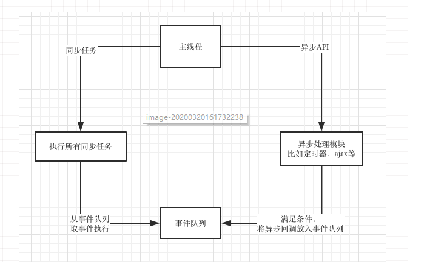
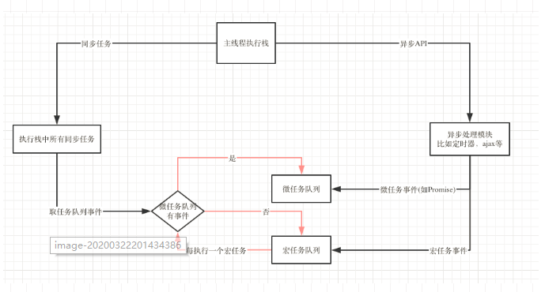

#  事件循环机制

## 怎么来的及作用

javascript 是单线程从脚本语言，为了防止主线程阻塞，事件循环机制应运而生；

## 执行栈和执行上下文环境

函数在被调用时，会形成一个执行上下文环境，执行上下文环境中包含函数的信息，比如函数的参数，函数的调用栈，this指针等信息。
这个执行上下文环境会被压入到栈内存，所以也叫执行栈；

## 主线程

主线程决定现在执行 执行栈中的哪个事件。 主线程循环即会不停的从执行栈中读取事件，并执行任务。当遇到异步事件时，并不会等待异步事件返回结果，而是将异步事件放入与执行栈不同的任务队列中，

## 同步和异步

同步任务是按代码的书写顺序，从上到下来执行；

异步任务并不是按书写顺序，排队立即执行，而是我们给异步任务设置了触发条件，在满足这个触发条件前，可以先去执行别的代码；所以异步的一个好处就是不会给单线程的js带来阻塞的问题；

## 异步是怎么实现的？

我们都知道JS是单线程的，那单线程是怎么实现异步的呢？事实上所谓的"JS是单线程的"只是指JS的主运行线程只有一个，而不是整个运行环境都是单线程。JS的运行环境主要是浏览器，以大家都很熟悉的Chrome的内核为例，他不仅是多线程的，而且是多进程的：

  

从上图可以看出，运行环境是多线程的，对于前端工程师来说，主要关心的还是渲染进程，下面来分别看下里面每个线程是做什么的。

>  GUI 

GUI线程就是渲染页面的，他解析HTML和CSS，然后将他们构建成DOM树和渲染树就是这个线程负责的。

> JS 引擎线程

这个线程就是负责执行JS 的主线程，前面说的"JS是单线程"就是指的这个线程，大名鼎鼎的chrome v8引擎就是在这个线程运行的；

但是要注意，这个线程和GUI 线程是互斥的，互斥的原因是JS可以操作DOM，如果JS引擎线程和GUI 线程同时操作DOM结果就混乱了，不知道到底渲染哪个结果。这带来的后果就是，如果JS 长时间运行，GUI 线程就不能执行，导致整个页面就卡死。

> 定时器线程

异步任务的例子定时器， 就是运行在这里， 跟js主线程根本不在同一个地方 ，所以"单线程的JS"能够实现异步；

> 事件触发线程

定时器线程只是起一个定时的作用，并不会执行时间到了的回调，真正执行回调的还是JS 主线程。所以时间到了定时器线程会将回调事件发送给事件触发线程，然后事件触发线程将这个回调事件添加到事件队列中去。最终，JS主线程从事件队列中读取回调执行。

事件触发线程不仅可以将定时器事件放入任务队列，也负责将其他满足条件的事件放入任务队列；

> 异步HTTP请求线程

这个线程负责处理异步的ajax 请求，当请求完成后，会通知事件触发线程， 事件触发线程将这事件放入事件队列，等待主线程执行；

## JS异步的实现机制：

所以JS异步的实现靠的就是浏览器的多线程，当他遇到异步API时，就将这个任务交给对应的线程，当这个异步API满足回调条件时，对应的线程又通过事件触发线程将这个事件放入任务队列，然后主线程从任务队列取出事件继续执行。这个流程我们多次提到了任务队列，这其实就是

> Event Loop 

浏览器环境的事件循环和Node环境的事件循环是有些区别的

## 浏览器环境的Event Loop

事件循环就是一个循环，是各个异步线程用来通讯和协同执行的机制。各个线程为了交换消息，还有一个公用的数据区，这就是事件队列。各个异步线程执行完后，通过事件触发线程将回调事件放到事件队列，主线程每次干完手上的活儿就来看看这个队列有没有新活儿，有的话就取出来执行。流程图如下：

 

+ 1. 主线程每次执行时，先看执行的是同步任务还是异步API ;
+ 2. 遇到同步任务就继续执行，一直到执行完；
+ 3. 遇到异步API，就把它交给对应的异步线程，自己就行执行同步任务；
+ 4. 异步线程执行异步API ,执行完后，就将回调事件放入事件队列；
+ 5. 主线程上的同比任务执行完后，就读取事件队列中的回调函数并执行；
+ 6. 以上流程不断反复进行，这就是所谓的事件循环机制；

## 为什么定时器不准？

事实上，js中的定时任务并不一定是准时执行，定时事实上是指最早时间；

导致这个现象发生的原因，是因为js 线程总是先执行同步任务，然后再执行事件队列中的回调函数；遇到定时器，现将它交给定时器线程，开始计时，比如2秒，2秒后触发回调事件，事件触发线程就将这个回调事件放入事件队列，异步流程到此结束。主线程如果有空，就将定时器回调拿出来执行，否则计时器回调函数就一直放在队列里。

## 事件队列详解

上面理解event loop 的过程中，为了方便理解事件循环，我们简化了事件队列； 事实上，事件队列中的事件分两类： 宏任务和微任务。

微任务拥有更高的优先级，当事件循环遍历队列时，先检查微任务队列，如果里面有任务，就全部拿来执行，执行完之后再执行一个宏任务。执行每个宏任务之前都要检查下微任务队列是否有任务，如果有，优先执行微任务队列。所以完整的流程图如下：

想要知道一个异步API 在哪个阶段执行， 就要弄清楚它是宏任务还是微任务；

常见微任务：

+ 1. Promise
+ 2. process.nextTick
+ 3. Object.observe

常见宏任务：

+ 1. setTimeout , setInterval
+ 2. I/O
+ 3. UI 事件

##  总结：

+ 1. 所谓的"JS 单线程" 指的是主线程只有一个，并不是整个运行环境都是单线程；
+ 2. JS 的异步靠底层的多线程实现；
+ 3. 不同的异步API 对应不同的实现线程；
+ 4. 异步线程与主线程通讯靠的是Event Loop
+ 5. 异步线程完成任务后将其放入任务队列
+ 6. 主线程不断轮询任务队列，拿出任务执行
+ 7. 任务队列有宏任务队列和微任务队列的区别
+ 8. 微任务队列的优先级更高，所有微任务处理完后才会处理宏任务
+ 9. Promise是微任务