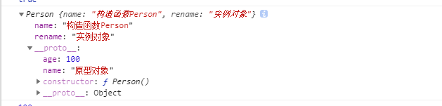

> # 原型和原型对象

在JavaScript中，我们创建一个函数A, 那么浏览器(准确的说是JavaScript引擎)就会在内存中创建一个对象B,
函数A 有一个默认的属性prototype指向对象B(即prototype的属性值就是对象B) ;

对象B 就是函数A 的原型对象，简称函数的原型；

原型对象B 默认会有一个属性constructor指向函数A


>  函数的 prototype 属性

指向函数的原型对象

> constructor 属性

对象的constructor属性，返回创建该对象的函数，也就是常说的构造函数

>     __proto__ 属性

实例对象的__proto__ 属性返回该实例对象的构造函数的原型对象

-------

>  在构造函数上定义属性和方法，它的实例对象会继承这些属性和方法，继承的实质是自动再定义一遍属性和方法；同时实例对象还会有一个__proto__ 属性，
  通过这个__proto__ 属性，我们可以看到构造函数的原型对象上的属性和方法， 这些属性和方法会被所有实例对象所共享，也就实现了继承；


```javascript
             function Person() {
                this.name = "构造函数Person"
            }
            Person.prototype.age = 100
            Person.prototype.name = "原型对象"

            let p = new Person()
            p.rename = "实例对象"
            console.log(p)
            
       // 打印 实例对象p 
```
   


# 重点理解如下代码
  ```javascript
        //构造函数的prototype 属性指向原型对象 ， 实例对象的__proto__ 属性也指向的是原型对象；
      Person.prototype === p.__proto__ === p.constructor.prototype   // true 

      Person.prototype.constructor === p.constructor=== Person 

  ```

> # 原型链

每个对象都有 __proto__ 属性，通过该属性可以找到该对象的原型对象，通过原型对象的__proto__属性又可以找它自己的原型对象，以此类推，形成了所谓的原型链；
当查找对象上的某个属性时，先去该对象上找，找不到就去它的原型对象上找，如果还是没有的话再去向原型对象的原型对象里去寻找...... 层层向上直到一个对象的原型对象为 null。这个操作被委托在整个原型链上，这个就是我们说的原型链了。

> # JavaScript中的继承

每一个对象都会从它的原型对象继承属性。

实际上，继承是一个十分具有迷惑性的说法。继承意味着复制操作，然而JavaScript中并不会复制对象的属性，相反，JavaScript只是在两个对象之间创建一个关联，
这样，一个对象就可以通过委托，访问到另一个对象的属性和方法，所以，与其说是继承，委托的说法反而更准确些。