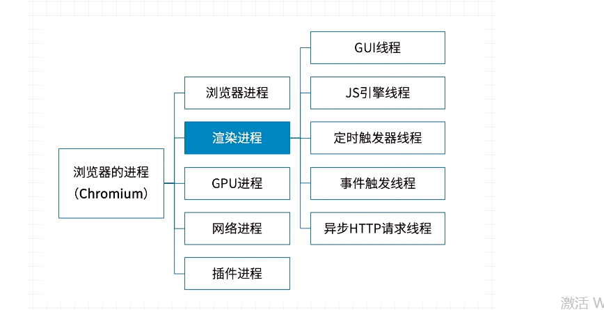

# 一.进程和线程的概念

首先我们要先了解进程和线程的概念，在计算机原理中：

> 1.进程是CPU资源分配的最小单位（是能拥有资源和独立运行的最小单位，进程之间不会共享资源）  
> 2.线程是CPU调度的最小单位（线程是建立在进程的基础上的一次程序运行单位，一个进程中可以有多个线程，多个线程之间共享进程的资源）  
> 3.不同进程之间也可以通信，但是代价会比较大
而这里进程和线程的关系就像是工厂和工厂的工人，不同的工厂有自己的资源，空间。而工厂里面也会有很多的工人，工人是没有自己的资源和空间的，但是他们可以使用和共享工厂的资源和空间

# 二.浏览器中的进程

在理解了进程和线程以后，我们再来对浏览器进行一定程度上的认识。

>1.浏览器是多进程  
>2.浏览器之所以能够运行，是因为系统给它的进程分配了资源（cpu、内存）  
>3.浏览器每新开一个页签，系统相当于创建了一个独立的进程
如何验证呢？最简单的方式，就是直接打开浏览器的任务管理器，会发现每一个新开的页签，都会在任务管理器中新增一个进程，浏览器会给页签分配内存和cpu

### 浏览器中有哪些进程

  

> 1.浏览器进程(Browser进程)：浏览器的主进程(负责协调，主控)，只有一个  

> >  1）负责浏览器的界面界面显示，与用户交互，网址栏输入、前进、后退等  
>> 2）负责管理各个页面，创建和销毁进程  
>> 3）将页面内容(位图)写入到浏览器内存中，最后将图像显示在屏幕上  
>> 4）文件存储等功能  

> 2.渲染进程(浏览器内核，Renderer进程，内部是多线程的)：默认一个tab页面一个渲染进程(特殊情况下：渲染进程不一定每个tab就一个)，主要的作用为页面渲染，脚本执行，事件处理等

> 3.GPU进程：用于3D绘制等，将开启了3D绘制的元素的渲染由CPU转向GPU，也就是开启GPU加速。最多一个

> 4.网络进程：主要负责页面的网络资源加载，之前是作为一个模块运行在浏览器进程里面，现在独立开来，成为一个单独的进程

> 5.插件进程：每种类型的插件对应一个进程，仅当使用该插件时才创建

> 6.音频进程：浏览器音频管理

### 浏览器多进程的好处
相比于单进程浏览器，多进程有几点好处：

1.避免单个页面崩溃影响整个浏览器
2.避免第三方插件崩溃时影响整个浏览器
3.多进程充分利用多核优势
4.方便使用沙盒模型隔离插件等进程，提高浏览器稳定性
整体来说就是利用空间换时间，牺牲内存

# 三.浏览器的线程

从上图可以看出，浏览器环境是多进程、多线程的，对于前端工程师来说，主要关心的还是渲染进程，下面来分别看下里面每个线程是做什么的。

  

#### 1.GUI渲染线程

1）负责渲染浏览器界面，解析HTML，CSS，构建DOM树和RenderObject树，布局和绘制
2）当界面需要重绘(Repaint)或由于某种操作引发回流(reflow)时，该线程就会执行
3）与JS引擎互斥，当执行JS引擎线程时，GUI会pending，当任务队列空闲时，才会继续执行GUI

#### 2.JS引擎线程

1）也称为JS内核，负责处理javascript脚本程序
2）JS引擎线程负责解析Javascript脚本，运行代码
3）JS引擎一直等待任务队列中任务的到来，然后加以处理，浏览器无论什么时候都只有一个JS线程在运行JS程序
4）同样注意，GUI渲染线程与JS引擎线程时互斥的，所以如果JS执行的时间过长，这样就会造成页面的渲染不连贯，导致页面渲染加载阻塞。

#### 3.事件触发线程

1）事件触发线程归属于浏览器而不是JS引擎(辅助JS引擎)，用来控制事件循环(存在一个事件队列)
2）当JS引擎执行代码块如setTimeOut时(也可来自浏览器内核的其他线程，如鼠标点击，Ajax异步请求等)，会将对应的任务添加到事件线程中
3）当对应的事件符合触发条件被触发时，该线程会把事件添加到待处理队列的队尾，等待JS引擎的处理
4）注意，由于JS的单线程关系，所以这些待处理队列的事件都得排队等待JS引擎的处理(当JS引擎空闲时才会去执行)

#### 4.定时触发器线程

1）setInterval、setTimeOut所在线程
2）浏览器定时计数器并不是由JavaScript引擎计数的，(因为JavaScript引擎时单线程的，如果处于阻塞线程状态就会影响计时的准确)
3）因此通过单独线程来计时并触发(计时完毕后，添加到事件队列中，等待JS引擎空闲后执行)
4）注意，W3C在HTML标准中规定要求setTimeOut中低于4ms的时间间隔为4ms

#### 5.异步HTTP请求线程(IO线程)

1）在XMLHttpRequest在连接后是通过浏览器新开一个线程请求
2）将检测到状态变更时，如果设置有回调函数，异步线程就产生状态变更事件，将这个回调再放入事件队列中(放入事件触发线程中)。再由JavaScript引擎执行。

### 从上面的概念我们可以得到几点总结：

浏览器是多进程的。
js执行的主线程为JS引擎，并且无论何时都只有一个JS线程在运行，所以是单线程执行。
GUI渲染线程和JS引擎线程是互斥的，并且JS会阻塞页面的加载和渲染。
定时器(setInterval,setTimeout)会在定时器触发器线程中进行计时。
定时触发器线程计时结束后需要执行的事件和异步HTTP请求线程的回调事件都会进入到事件触发线程的任务队列中等待JS引擎的执行