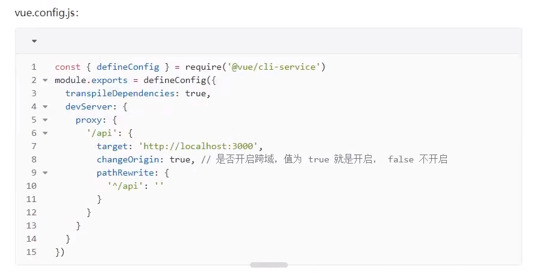

# 跨域问题


#### 1.jsonp

#### 2. CORS (跨域资源共享)

 由后端设置响应头中的Access-Control-Allow-Origin字段。该属性表示哪些域名可以访问资源，如果设置通配符，则表示所有的请求地址都可以访问到资源。

```JavaScript

    res.header("Access-Control-Origin","*") // 都可以访问

```

#### 3. 代理转发

>1. vue-cli 创建的项目中，配置代理服务器，项目启动，本地启动一个服务器。

同源策略是浏览器要遵循的标准，而服务器向服务器请求就无需遵循同源策略。
  
  

// api 里的target值就是跨域的地址

上面就是通过vue的配置文件，把我们发送的请求转发到了本地运行的服务器，再转发到后端的请求地址，从而跳过了服务器，也就不受同源策略的限制。

两台服务器之间的请求不是通过浏览器进行的，而是通过网络传输协议（通常是http或者tcp协议）进行的，所以不存在跨域。

> 2. 自己用node 在本地搭建一个服务器。用来代理转发。

#### 4. 安装一个可以跨域的浏览器（）
