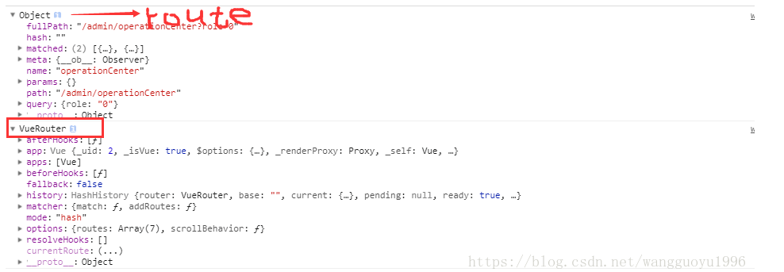

## 1. <router-link ：to=""> 

 创建 a 标签来定义导航链接 

## 2. this.$router.push({})  

``` 
    //1. params 传参 , 特点： 页面刷新时，参数会消失
    this.$router.push({
        name:"componentName",  // 组件名
        params:{
    
        }
    })

    // 2. query 传参, 带查询参数，变成 /user?name=jack;  页面刷新， 查询参数仍然在
    this.$router.push({
        path:"user" ,  // 路由路径
        query : {
            name:"jack"
        }
    })
```

## 3. router 和route 的区别

 this.$route 是当前的路由对象，包含路由的各种信息

 this.$router  是VueRouter的实例

  打印如下图：

    

## 4. 取路由对象中的参数

this.$route.params.属性名

this.$route.jquery.属性名