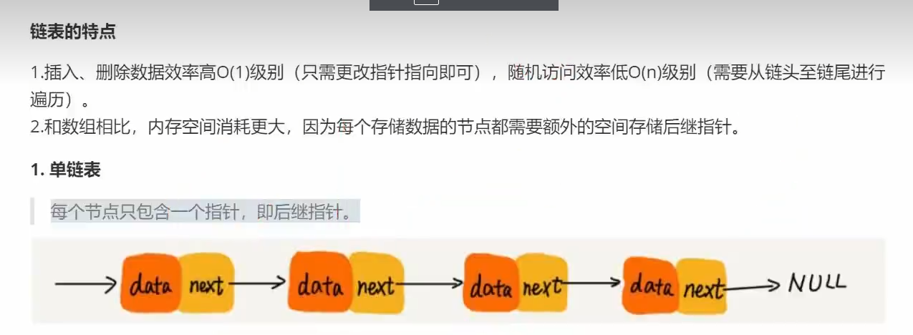

# 单链表



插入和删除效率高，但是查找和修改效率低。

```
  class Node {
        constructor(element) {
          this.element = element;
          this.next = null;
        }
      }
      class LinkedList {
        constructor() {
          this.head = null;
          this.count = 0;
        }
        push(element) {
          const node = new Node(element);
          if (this.head === null) {
            this.head = node;
          } else {
            let current = this.head;
            while (current.next !== null) {
              current = current.next;
            }
            current.next = node;
          }
          this.count++;
        }
      }
      let list = new LinkedList();


```
