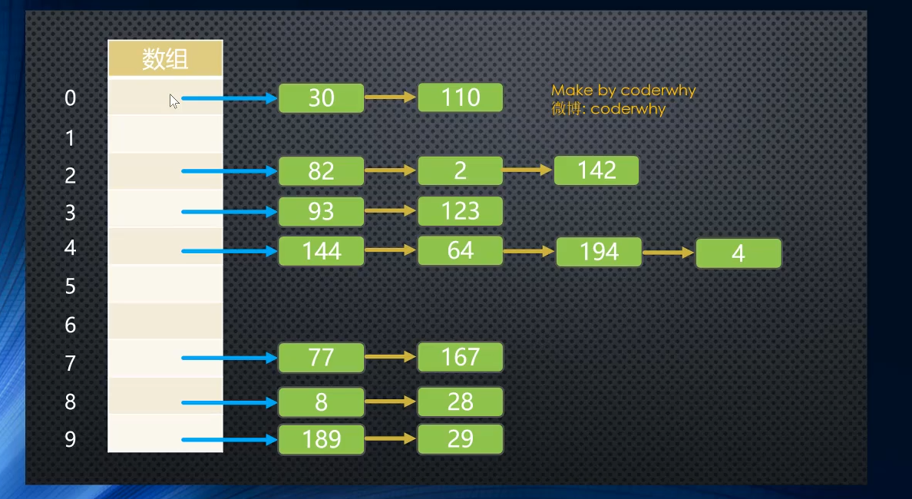
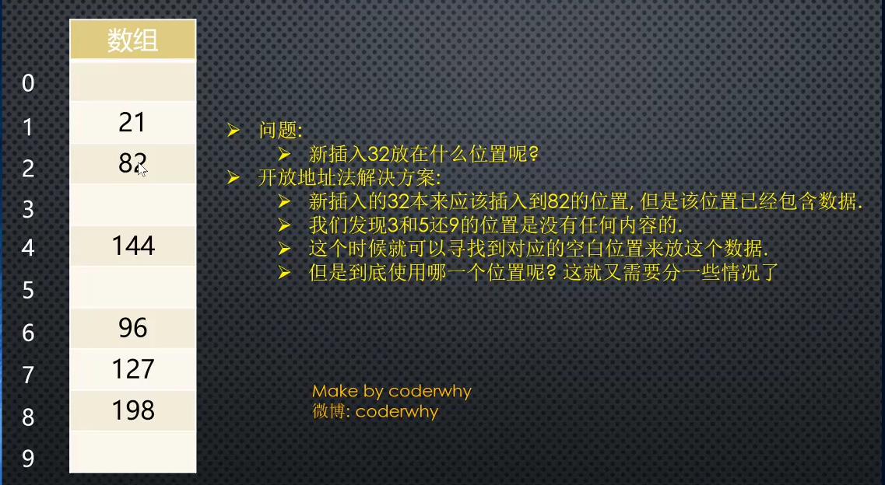

# 哈希表

哈希表通常是基于数组实现的。数组的增删改，效率都不高，

查找的时候，如果是基于索引效率非常高，可以直接定位到要查找的元素，但是基于内容查找的话，效率也不高。

相对于数组，哈希表 增删改查效率都很高。

1.哈希表中的数据是无序的不能以固定的方式（比如从小到大）来遍历其中的元素

2.通常情况下，哈希表中的 key 是不允许重复

哈希表中， 可以通过哈希函数，传入元素名称，拿到元素索引值，再用索引值直接去数组中定位到该元素。所以效率非常高。

#### 哈希表冲突

通过哈希函数，得到的索引如果冲突了， 可以采取链地址法(也叫拉链法)，开发地址法

链地址法：



开发地址法： 其实就是寻找空白的位置来防止冲突的数据项。


#### 哈希函数的实现

```
 //设计哈希函数
      //1 . 将字符串转成比较大的数字： hashCode
      //2. 将大的数字hashCode 压缩到数组范围（大小）之内

      function hashFunc(str, size) {  // size 指的是准备存入的数组长度
        //1. 定义hashCode 变量
        let hashCode = 0;

        // 2. 霍纳算法，来计算hashCode 的值
        // cats =>  Unicode 编码
        for (let i = 0; i < str.length; i++) {
          hashCode = 37 * hashCode + str.charCodeAt(i); // 37 随意取的一个质数
        }

        // 3.取余操作
        let index = hashCode % size;
        return index;
      }

```

####  封装哈希表

 
